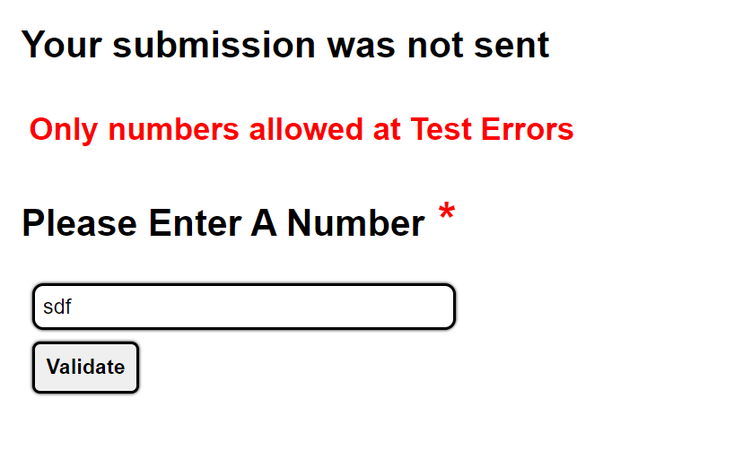

### `Input Validation With Asterisk and Notification`

#### `Created By: David Couch, 7/17/2021`
***
## `About`

This is a small simple but scalable application dedicated to implementing yup validation with callback objects to pass through information to the catch block using Typescript.
  
`This concept will provide`
  
- Asterisk is hidden if no error occurred during submission
- Asterisk notification on titles of inputs if there are errors.
- If a form is paginated state can be set to move the user back to page where the error occurred.
- Users get a plain english explanation of where the error occurred

## `Tech`

- react
- styled-components
- typescript
- yup


## `Preview`



  
## `Install`

#### `Git`
Download this file by either download the zip file or cloning the repo

- click on the green "code" button while viewing this from github

- select the HTTPS repo link and copy it to your clipboard by clicking the clipboard button

- from your terminal type in git clone { repo here }

```
git clone https://github.com/dcouch440/input-validation-with-asterisk-and-notification.git
```

- then change directories to the downloaded repo

```
  cd input-validation-with-asterisk-and-notification
```

- open the project by typing

```
code .
```
  
From here you can view the project!
  
#### `Zip`
  
- click the green "code" button
  
- click Download ZIP
  
##### `Drop in?`
- most code editors let you drop in the folder!
- open your code editor and drop the folder in!
